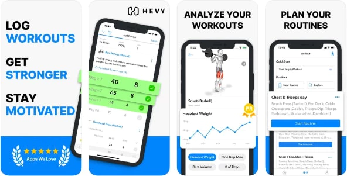

# Hevy Integration for Home Assistant

[](https://github.com/hudsonbrendon/HA-hevy/actions/workflows/lint.yml)
[](https://github.com/hudsonbrendon/HA-hevy/actions/workflows/test.yml)
[](https://github.com/hudsonbrendon/HA-hevy/actions/workflows/validate.yml)
[](https://github.com/hacs/integration)
[](https://github.com/hudsonbrendon/HA-hevy/releases)



Bring your [Hevy](https://hevy.com) workout tracker into Home Assistant: dashboards, automations, calendar, and event triggers for every completed lift.

> **Requires a Hevy Pro account** — the Hevy public API is currently Pro-only. Get your key at <https://hevy.com/settings?developer>.

---

## Installation

### HACS (recommended)

1. Ensure [HACS](https://hacs.xyz/) is installed.
2. HACS → Integrations → search **Hevy** → Install.
3. Restart Home Assistant.

### Manual

1. Download the [latest release](https://github.com/hudsonbrendon/HA-hevy/releases).
2. Copy `custom_components/hevy/` into your HA `custom_components/` directory.
3. Restart Home Assistant.

## Configuration

1. **Settings → Devices & Services → Add Integration** → search **Hevy**.
2. Paste your API key and pick a name for the device.
3. Done — sensors, binary sensors, and the calendar entity are created automatically.

---

## Entity reference

### Aggregate sensors (one set per integration entry)

| Entity | Unit | Description |
|---|---|---|
| `sensor.hevy_<name>_workout_count` | — | Total workouts on the account |
| `sensor.hevy_<name>_today_count` | — | Workouts completed today |
| `sensor.hevy_<name>_this_weeks_workouts` | — | Workouts in the last 7 days |
| `sensor.hevy_<name>_this_months_workouts` | — | Workouts in the current month |
| `sensor.hevy_<name>_this_years_workouts` | — | Workouts in the current year |
| `sensor.hevy_<name>_last_workout` | — | Title of the most recent workout (attrs: `exercise_count`, `total_reps`) |
| `sensor.hevy_<name>_last_workout_start` | timestamp | When the last workout started |
| `sensor.hevy_<name>_last_workout_duration` | min | Duration of the last workout |
| `sensor.hevy_<name>_last_workout_volume` | kg | Total weight × reps in the last workout |
| `sensor.hevy_<name>_volume_today` | kg | Total volume lifted today |
| `sensor.hevy_<name>_volume_this_week` | kg | Total volume in the last 7 days |
| `sensor.hevy_<name>_volume_this_month` | kg | Total volume this month |
| `sensor.hevy_<name>_volume_this_year` | kg | Total volume this year |
| `sensor.hevy_<name>_training_time_today` | min | Minutes trained today |
| `sensor.hevy_<name>_training_time_this_week` | min | Minutes trained in the last 7 days |
| `sensor.hevy_<name>_training_time_this_month` | min | Minutes trained this month |
| `sensor.hevy_<name>_current_streak` | days | Consecutive days with a workout (today or yesterday counted) |
| `sensor.hevy_<name>_longest_streak` | days | Best historical streak from cached workouts |
| `sensor.hevy_<name>_unique_exercises_7d` | — | Distinct exercise templates in the last 7 days |
| `sensor.hevy_<name>_unique_exercises_30d` | — | Distinct exercise templates in the last 30 days |
| `sensor.hevy_<name>_body_weight` | kg | Latest body weight measurement (attr: `date`) |
| `sensor.hevy_<name>_body_fat` | % | Latest body fat percentage |
| `sensor.hevy_<name>_lean_mass` | kg | Latest lean mass measurement |
| `sensor.hevy_<name>_user` | — | Hevy user display name (attrs: `user_id`, `profile_url`) |

### Binary sensors

| Entity | Description |
|---|---|
| `binary_sensor.hevy_<name>_workout_today` | `on` if any workout started today |
| `binary_sensor.hevy_<name>_workout_this_week` | `on` if any workout started in the last 7 days |

### Per-workout entities

For each of the 10 most recent workouts:

- `sensor.hevy_<name>_workout_date` — start time (TIMESTAMP).
- One sensor per exercise titled after the exercise (e.g. `sensor.bench_press`). State is the max weight in kg; attrs: `sets`, `total_reps`, `volume_kg`.

### Calendar

| Entity | Description |
|---|---|
| `calendar.hevy_<name>_workouts` | Each cached workout as a CalendarEvent. Drop into a calendar card or use as a trigger source. |

---

## Events fired

The integration fires events on every poll cycle (default 60 min) when the workout cache changes.

| Event | When | Payload |
|---|---|---|
| `hevy_workout_completed` | A workout id newly appears in the cache | `id`, `title`, `start_time` (ISO), `duration_min`, `volume_kg`, `total_reps`, `exercise_count` |
| `hevy_workout_deleted` | A previously cached workout id disappears | `id`, `title` |

The first refresh after startup is silent — events fire only for diffs against the previous poll.

---

## Automation examples

### Notify when you complete a workout

```yaml
automation:
  - alias: Hevy — workout completed notification
    trigger:
      - platform: event
        event_type: hevy_workout_completed
    action:
      - service: notify.mobile_app_my_phone
        data:
          title: "💪 Workout logged"
          message: >-
            {{ trigger.event.data.title }}
            • {{ trigger.event.data.duration_min }} min
            • {{ trigger.event.data.volume_kg }} kg total
```

### Play a workout playlist when a session starts

```yaml
automation:
  - alias: Hevy — start workout playlist
    trigger:
      - platform: event
        event_type: hevy_workout_completed
    condition:
      - condition: time
        after: "06:00:00"
        before: "10:00:00"
    action:
      - service: media_player.play_media
        target:
          entity_id: media_player.living_room
        data:
          media_content_id: spotify:playlist:your_id
          media_content_type: playlist
```

### Streak alert if you skip 3 days

```yaml
automation:
  - alias: Hevy — streak about to break
    trigger:
      - platform: numeric_state
        entity_id: sensor.hevy_hudson_current_streak
        below: 1
        for: "72:00:00"
    action:
      - service: notify.mobile_app_my_phone
        data:
          message: "Streak broken — get back in the gym 🏋️"
```

### Weekly volume gauge card

```yaml
type: gauge
entity: sensor.hevy_hudson_volume_this_week
unit: kg
min: 0
max: 15000
severity:
  green: 8000
  yellow: 4000
  red: 0
```

### Workout calendar card

```yaml
type: calendar
entities:
  - calendar.hevy_hudson_workouts
```

---

## How polling works

- Default refresh interval: **60 minutes**.
- Each refresh fetches in parallel: `/workouts/count`, `/workouts` (10 most recent), `/user/info`, `/body_measurements`.
- Optional endpoints (user, measurements) fail gracefully — sensors degrade to `unknown` without taking the integration down.
- Authentication failures trigger HA's reauth flow.

## Troubleshooting

| Symptom | Likely cause / fix |
|---|---|
| Setup fails with auth error | Verify your key at <https://hevy.com/settings?developer> and re-add. Pro account required. |
| No `body_*` sensors update | You haven't logged any body measurements in Hevy yet. |
| Calendar empty | Only the 10 most recent workouts are cached. Train more 😉. |
| Events don't fire | First refresh after restart is silent. Wait one poll cycle (default 60 min). |

## Removal

1. **Settings → Devices & Services → Hevy → ⋮ → Delete** — removes all entities and the config entry.
2. If installed via HACS, also remove the integration from **HACS → Integrations** to stop receiving updates.
3. For manual installs, delete the `custom_components/hevy/` directory and restart Home Assistant.

Your Hevy account data is not touched. Revoke the API key at <https://hevy.com/settings?developer> if you no longer want HA to access it.

## Contributing

Issues and PRs welcome. The repo has:
- `ruff check .` + `ruff format .` for linting.
- `pytest tests/` for the test suite (140+ tests, no HA install needed — uses lightweight stubs).
- CI runs all three workflows on every PR.

See [CONTRIBUTING.md](CONTRIBUTING.md) for the full contribution guide.

***

[commits-shield]: https://img.shields.io/github/commit-activity/y/hudsonbrendon/HA-hevy.svg
[commits]: https://github.com/hudsonbrendon/HA-hevy/commits/main
[hacs]: https://github.com/hacs/integration
[hacs-shield]: https://img.shields.io/badge/HACS-Default-orange.svg
[license-shield]: https://img.shields.io/github/license/hudsonbrendon/HA-hevy.svg
[releases-shield]: https://img.shields.io/github/release/hudsonbrendon/HA-hevy.svg
[releases]: https://github.com/hudsonbrendon/HA-hevy/releases
