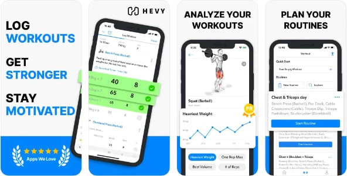

# Hevy Integration for Home Assistant




This custom component integrates Hevy workout tracking with Home Assistant, allowing you to monitor your fitness data directly in your smart home dashboard.

## Features

- Display your total workout count from Hevy
- Track workout frequency and consistency
- Monitor recent workouts and activities
- Access workout details including duration, exercises, and volume
- Create automations based on your workout data
- View historical workout trends
- Multi-language support (English, Portuguese)

## How It Works

The integration connects to the Hevy API using your personal API key and retrieves your workout data. This data is then made available as sensors in Home Assistant that you can use in dashboards, automations, or scripts. The integration updates periodically to ensure your data is current.

## Installation

### HACS (Recommended)

1. Make sure [HACS](https://hacs.xyz/) is installed in your Home Assistant instance.
2. Add this repository to HACS as a custom repository.
3. Search for "Hevy" in HACS and install it.
4. Restart Home Assistant.

### Manual Installation

1. Download the latest release from GitHub.
2. Extract and copy the `custom_components/hevy` folder to your Home Assistant's `custom_components` directory.
3. Restart Home Assistant.

## Configuration

1. Go to Home Assistant's Configuration > Integrations.
2. Click the "+ Add Integration" button and search for "Hevy".
3. Follow the setup wizard to enter your Hevy API key.
4. Configure the update interval and select which data points you want to track.
5. Once configured, the integration will create several sensors that you can add to your dashboards.

## Obtaining your API Key

To use this integration, you'll need your Hevy API key:

1. Log into your Hevy account on the web or mobile app
2. Navigate to Account Settings > API Access
3. Generate a new API key if you don't already have one
4. Copy this key for use in the Home Assistant integration

Example API request using your key:
```
curl -X 'GET' \
  'https://api.hevyapp.com/v1/workouts/count' \
  -H 'accept: application/json' \
  -H 'api-key: YOUR_API_KEY_HERE'
```

## Available Entities

After setting up the integration, the following entities will be available:

### Sensor Entities
- `sensor.hevy_workout_count`: Total number of workouts recorded
- `sensor.hevy_today_count`: Number of workouts completed today
- `sensor.hevy_week_count`: Number of workouts completed this week
- `sensor.hevy_month_count`: Number of workouts completed this month
- `sensor.hevy_year_count`: Number of workouts completed this year

### Binary Sensor Entities
- `binary_sensor.hevy_workout_today`: Indicates if a workout was completed today (on/off)
- `binary_sensor.hevy_workout_this_week`: Indicates if any workouts were completed in the last 7 days (on/off)

### Workout-Specific Entities
For each workout in your history, the following entities are created:
- `sensor.hevy_workout_date`: Timestamp when the workout was performed
- Exercise-specific sensors showing the maximum weight used for each exercise (e.g., `sensor.bench_press`)

Each exercise sensor includes additional attributes:
- `sets`: Number of sets performed
- `total_reps`: Total repetitions across all sets

## Usage Examples

### Dashboard Card Example
```yaml
type: entities
entities:
  - sensor.hevy_workout_count
  - sensor.hevy_last_workout_date
  - sensor.hevy_weekly_workout_count
title: My Fitness Tracking
```

### Automation Example
```yaml
alias: Workout Reminder
description: Remind me if I haven't worked out in 3 days
trigger:
  - platform: template
    value_template: >
      
      
      {{ days > 3 }}
action:
  - service: notify.mobile_app
    data:
      message: It's been {{ days }} days since your last workout!
```

## Troubleshooting

- **No data appearing**: Verify your API key is correct and that you have workouts in your Hevy account
- **Integration offline**: Check your internet connection and ensure Hevy's API is accessible
- **Update delays**: The data refreshes according to your configured interval; you can trigger a manual refresh from the integration page
